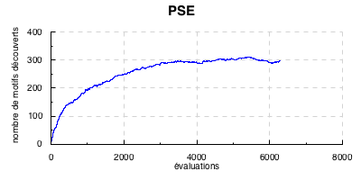
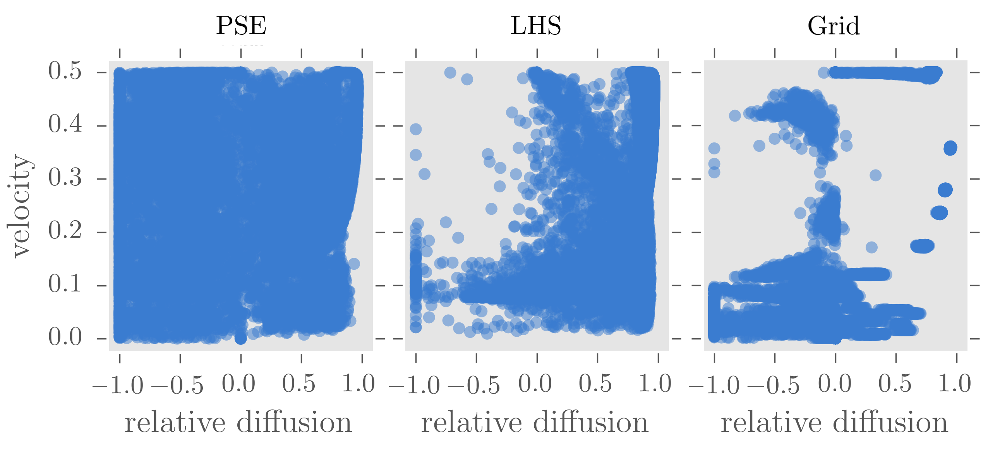
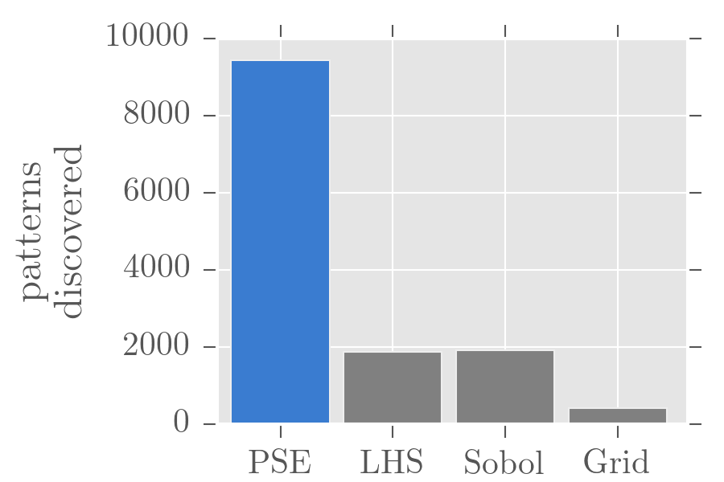
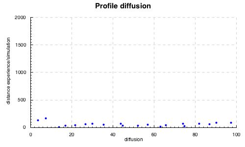
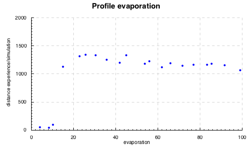
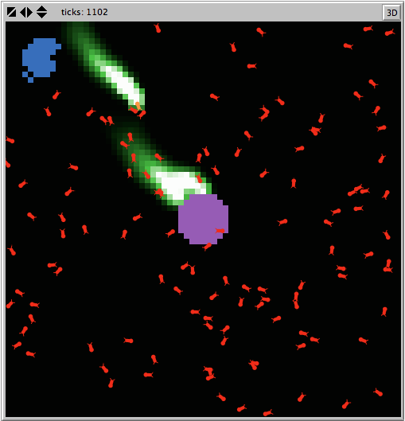

# Calibration, validation et sensitivity analysis of complex systems models with OpenMOLE

Guillaume Chérel, 2015-10-23

Translated from the french by Guillaume Chérel, Mathieu Leclaire, Juste Raimbault, Julien Perret.

 Guillaume Chérel, 2015

This text is licensed under the Creative Commons Attribution-ShareAlike 4.0 International License. To view a copy of this license, visit http://creativecommons.org/licenses/by-sa/4.0/.

Validation: Putting a model to the test
----------------------------------------

*Associated OpenMOLE Script: [ants\_pse/ants\_pse.oms](ants_pse/ants_pse.oms)*

*Associated Article: Chérel G., Cottineau C., Reuillon R., 2015, " Beyond Corroboration: Strengthening Model Validation by Looking for Unexpected Patterns ", PLoS ONE 10(9): e0138212. doi:[10.1371/journal.pone.0138212](http://journals.plos.org/plosone/article?id=10.1371/journal.pone.0138212)*

As stated before, knowing that a model can reproduce an observed phenomenon does not ensure its validity, that is to say that we can trust it to explain the phenomenon in other experimental conditions and that its predictions are valid for other parameter values. We already established that a way to put a model to the test was to search for the different behaviors it can exhibit. The discovery of unexpected behaviors, if they disagree with the experiment or the direct observation of the system it represents, provides us with the opportunity to revise the assumptions of the model or to correct bugs in the code. It also holds for the absence of expected pattern discovery, which reveals the incapability of the model to produce such patterns. As we test a model and as we revise it, we can obtain a model we can trust more to explain and predict a phenomenon.

One can wonder, for instance, if, according to our ant colony model, the closest food source is always exploited before the furthest. We decide to search the different patterns that the model generates in terms of time to drain the closest and the furthest food sources.

As in the previous experiment, we consider a task that runs 10 replications of the model with the same given parameter values and that provides, as its output, the median pattern described in two dimensions by the variables `medFood1`, the time in which the closest food source was exhausted, and `medFood3`, the time in which the furthest food source was exhausted.

To search for diversity, we use the [PSE (Pattern Space Exploration)](http://journals.plos.org/plosone/article?id=10.1371/journal.pone.0138212) method. As all evolutionary algorithms, PSE generates new individuals by combination of parent individuals and mutation.The specificity of PSE (inspired by the [novelty search method](http://eplex.cs.ucf.edu/noveltysearch/userspage/)) is to select the parents which patterns are rare compared to the rest of the population and to the previous generations. In order to evaluate the rarity of a pattern, PSE discretizes the pattern space, which divides this space into cells. Each time a simulation produces a pattern, a counter is incremented in the corresponding cell. PSE preferentially selects the parents whose associated cell has a low counter. By selecting the parents with rare patterns, we have a better chance to produce new individuals with behaviors never observed before.

In order to use PSE in OpenMOLE, the only thing to modify, compared to the calibration we saw in the previous section, is the evolution method. We need to provide the following parameters:
- inputs: the model parameters with their minimum and maximum bounds,
- observables: the observables measured for each simulation and for which we search for diversity,
- gridSize: the discretization step for each observable,
- reevaluate and termination have the same meaning as in the calibration example.

Here is the OpenMOLE code used for out entomological example:

    val evolution =
        BehaviourSearch (
          inputs =
            Seq(
              diffusion -> (0.0, 99.0),
              evaporation -> (0.0, 99.0)),
          observables =
            Seq(
              medFood1,
              medFood3),
          gridSize = Seq(40, 40),
          reevaluate = 0.01,
          termination = 1000000
        )

As the exploration progresses new patterns are discovered. The following figure gives the number of known patterns (the number of cells with a counter value greater than 0) with respect to the number of evaluations.

 

When this number stabilizes, PSE does not make new discoveries anymore. One has to be careful when interpreting this. Indeed, the absence of new discoveries can mean that all the patterns that the model can produce have been discovered, but it is also possible that other patterns exist but that PSE could not reach them.

The following figure shows the patterns discovered by PSE when we interrupted the exploration.

 

The first observation that can be made is that all patterns have indeed been discovered: the closest food source has been drained before the furthest one. Besides, there seems to be minimum and maximum bounds for the time during which the first food source is consumed.

These three observation give us as many starting points for further reflections on the collective behavior of ants. For instance, is the exploration of the closest food sources first systematic? Could there be ant species that would explore further food sources than others first? If we found such a species, we would have to wonder which mechanisms make it possible and revise the model to take them into account. This illustrates how the discovery of the different behaviors the model is able to produce can lead us to formulate new hypotheses of the system under study, to test them and to revise the model, thus enhancing our understanding of the phenomenon.

Why not simply sample the parameter space in order to know the different potential behaviors of the model using well known sampling methods such as LHS? In the context of an experiment using a collective motion model with 5 parameters, we compared the performances of PSE and 3 samplings in the parameter space: LHS, Sobol and a regular grid. The results presented in the next two figures show that the sampling of the parameter space, even with good coverage properties such as LHS and Sobol, can miss several patterns. Adaptative methods, such as PSE, that orient the search according to the discoveries made along the way, are preferable. The following figure shows the behaviors discovered by the proposed method (PSE for Pattern Space Exploration), by a LHS sampling and a regular grid.

Each point represents a discovered behavior of the model. The behaviors are described in two dimensions: the average velocity of the particles and their relative diffusion (towards 1, they move away from each other, at 0, they do not move relatively to each other, towards -1, they get closer to each other).

The following figure allows to compare PSE to other sampling methods in terms of efficiency.

Sensitivity analysis: Profiles
--------------------------------

*Linked OpenMOLE script: [ants\_profiles/ants\_profiles.oms](ants_profiles/ants_profiles.oms)*

*Article: Reuillon R., Schmitt C., De Aldama R., Mouret J.-B., 2015, "A New Method to Evaluate Simulation Models: The Calibration Profile (CP) Algorithm", JASSS : Journal of Artificial Societies and Social Simulation, Vol. 18, Issue 1, <http://jasss.soc.surrey.ac.uk/18/1/12.html>*

The method we now present aims at understanding better how the model works in focusing on the impact of the different parameters of the model. In our Anthills example, we previously calibrated the model to enforce it to reproduce fake experimental measurements. We would like to know whether the model can reproduce this pattern for other parameter values. It is possible for instance, that a parameter is crucial and yet the model cannot reproduce the experimental measurements for a different value other than the one found with the calibration. It is also possible, on the contrary, that another parameter is not essential at all, that is, the model can reproduce the experimental measurements whatever its value. To establish the relevancy of our model parameter, we will set the parameters profiles for the model and for the targeted pattern, as follows:

We begin with establishing the profile for evaporation parameter with the following method. We would like to know if the model is able to reproduce the targeted pattern for different values of the evaporation rate. The range of this parameter is divided into `nX` intervals of equal size. For each value of the corresponding discretization, we use a genetic algorithm to search for values of other parameters that minimize the distance between experimental data and model outputs, as done before in the calibration section. In our case for the ant model, the optimization is done on the single remaining parameter, the diffusion parameter. The profile is obtained by running the genetic algorithm and ensuring to keep at least one best individual for each value of the discretization for the profiled parameter, whereas in the calibration case, best individuals where kept whatever the value of parameters. Once the profile obtained, we can do the same with the diffusion parameter.

To establish a profile in OpenMOLE for a given parameter, we use the evolutive method GenomeProfile :

    val evolution =
       GenomeProfile (
         x = 0,
         nX = 10,
         inputs =
            Seq(
              diffusion -> (0.0, 99.0),
              evaporation -> (0.0, 99.0)),
         termination = 100 hours,
         objective = aggregatedFitness,
         reevaluate = 0.01
       )

The arguments `inputs`, `termination`, `objective` and `reevaluate` have the same role as in calibration. The argument `objective` is this time not a sequence but a single objective to minimize. The argument `x` specifies the index of the parameter to be profiled, i.e. its position within the `inputs` sequence , indexing starting at 0. `nX` is as explained before the size of the discretization of its range.

As for any evolutionary method, we need for each profile to create the OpenMOLE puzzle to execute it. We define a function returning the puzzle associated to a given parameter `parameter` and use it to assemble all pieces into a common puzzle, as follows :

    def profile(parameter: Int) = {
        val evolution =
           GenomeProfile (
             x = parameter,
             nX = 20,
             inputs =
                Seq(
                  diffusion -> (0.0, 99.0),
                  evaporation -> (0.0, 99.0)),
             termination = 100 hours,
             objective = aggregatedFitness,
             reevaluate = 0.01
           )

        val (puzzle, ga) = SteadyGA(evolution)(replicateModel, 40)
        val savePopulationHook = SavePopulationHook(ga, workDirectory / ("results/" + parameter.toString))
        val display = DisplayHook("Generation ${" + ga.generation.name + "}")
        (puzzle hook savePopulationHook hook display)
    }

    //assemblage
    val firstCapsule = Capsule(EmptyTask())
    val profiles = (0 until 2).map(profile)
    profiles.map(firstCapsule -- _).reduce(_ + _)

We obtain the following profiles :

 

 

Except for values below 10, the model is able to reproduce rather accurately experimental measures for any value of diffusion rate. A refined profile within the interval \[0;20\] may be useful to have a more precise idea. Concerning the evaporation parameter, model performance is on the contrary strongly sensitive, as values over 10 lead to a strong increase in minimal fit. When running the model with a diffusion rate of 21 and evaporation rate of 15, we observe that ants are not able to build a pheromone path enough stable between the nest and furthest food pile, what increases the time needed to exploit it in a considerable way.

 

Sensitivity analysis: Robustness of a calibration
-------------------------------------------------

The last method presented here aims to evaluate the robustness of a model calibration. We mean by a robust calibration that small variations of optimal parameters do not strongly change model behavior. In other words there should be no discontinuity in model indicators in a reasonable region around the optimal point. As a consequence, if parameter values are restricted to given regions of the parameter space, we expect the model to have roughly the same behavior within each region, especially within the region around the calibrated point.

Supposons par exemple que l'on puisse mesurer les valeurs de paramètres directement dans les données. Admettons que l'on puisse établir un intervalle de confiance pour chaque paramètre. On veut s'assurer que, tant que les valeurs de paramètres restent dans leur intervalle respectif, le modèle conserve toujours globalement le même comportement. Cette étape est importante lorsque l'on cherche à tirer des prédictions d'un modèle. Si le modèle produits des comportements très variés dans les intervalles considérés, alors il faut trouver quels paramètres sont responsables de cette variation et tenter de les mesurer avec plus de précision pour réduire l'intervalle de confiance.

This issue can be tackled using the PSE algorithm again, by running the above example with the desired confidence intervals for each parameter. The algorithm will aim to diversity of outputs within these interval, and the unveiling of significantly different patterns will imply that the model is sensitive to some parameters within the considered region. One must then either narrow parameters bounds again, or stay cautious on conclusions obtained through the calibrated model.

Conclusion
----------

The methods developed here are insights into a pattern-oriented of complex systems modeling and simulation, in the sense of patterns produced as outputs of model simulations. When data on internal mechanisms of a system or causing an emerging phenomenon are missing, because they are not directly observable for example, they can be formulated into algorithmic interpretations (models of simulation), which are candidate as explanations of the phenomenon. The method we developed here are various ways to verify wether these propositions are able to reproduce (regarding given objectives) the phenomenon they aim to explain, to test their predictive and explicative capabilities and to analyze the role of each parameter in their dynamic.

*This text by Guillaume Chérel is under a Creative Commons Attribution - Shar alike 4.0 International license. To obtain a copy of this license, please go to http://creativecommons.org/licenses/by-sa/4.0/ or send an inquiry to Creative Commons, 444 Castro Street, Suite 900, Mountain View, California, 94041, USA.*
