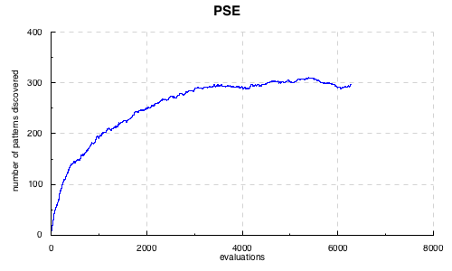
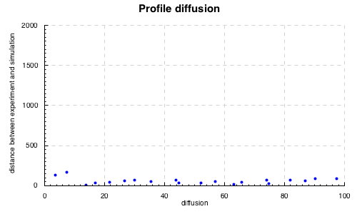
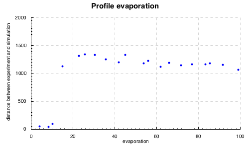

# Calibration, validation et sensitivity analysis of complex systems models with OpenMOLE

Guillaume Chérel, 2015-10-23

Translated from french by Guillaume Chérel, Mathieu Leclaire, Juste Raimbault, Julien Perret.

Complex systems models are difficult to explore in simulation because of they
can involve many paramters, be non linear and stochastic. We need to find way to
solve important modeling problems, like calibration, sensitivity analysis and
validation. In this tutorial, we will see how evolutionary algorithms can help
us solve these problems for complex systems models, and how to use them in
OpenMOLE.

Script files accompanying this documents
----------------------------------------

This document is part of a git repository which also contains the OpenMOLE
script files to execute the experiments presented below, and a Haskell source
file to perform the simulation results analysis and plotting. A link to the
corresponding OpenMOLE script is given below each section title. Please refer to
the [OpenMOLE documentation](http://www.openmole.org/) for directions on how to
use these scripts.

Data analysis and plotting was done with Haskell. The file
[analyses/analyses.hs](analyses/analyses.hs) contains commented functions
realizing the analyses. The directory [analyses](analyses) is formatted as a
[Stack](http://www.stackage.org/) project which deals with the necessary
dependencies. To use it, install stack and run:

    $ cd analyses #move into the directory
    $ stack setup #let stack install the right ghc version
    $ stack build #compile the project and install the dependencies
    $ stack exec EAForModelling #generate the figures

You can also generate the figures interactively with ghci. Instead of the last
command, use:

    $ stack ghci

This starts the haskell interpreter and you can call functions defined in
analyses.hs directly, such as `plot_ants_calibrate`, `plot_ants_pse` and
`plot_ants_profiles`.

The modeling problem we are trying to address
---------------------------------------------

We are in the context of writing a model to explain and observed phenomenon. For
example, we would like to explain the formation of ant lines between the nest
and a food source. We propose the following explanation:

- in general, ants move randomly,
- when they find food, they pick some up and go back to the nest,
- on their way back, they drop pheromones,
- when ants detect pheromones around them, they move toward it,
- pheromones evaporate at a given rate (parameter),
- when pheromones are droped by an ant, they diffuse with a certain diffusion
  rate (parameter).

Once this explanation is proposed, the difficulty is to test it and give it some
scientific value. These rules can be implemented algorithmically, which yields a
model that can be simulated. We will use a version of the NetLogo model *ants*
modified to include additional output variables. It is available in the file
[ants.nlogo](ants.nlogo).

 

The first thing to verify is that the model is able to reproduce the phenomena
it was designed to explain. We are thus looking for parameter values with which
the model in simulation reproduces the phenomena. This is the problem of
**inverse calibration**. It can be translated into an optimisation problem:
find the parameter values which minimise the distance between experimental
measurements or field data and the simulation results. Evolutionary algorithms
were first designed as optimisation methods and can be used to find solutions to
this kind of problems.

To know that a model can reproduce and observed phenomena does not entail that
it represents how the phenomena is actually produced in nature. Other
explanations could be possible. The proposed model is but one candidate among
several possibilities. It is probably out of reach to be certain that it is the
right one, and there can be more than one valid interpretation of the same
phenomena. But we can attempt to test its validity. This is the problem of model
**validation**.

One way to test the model is to look for its different possible behaviours,
that is, not only those we expect to reproduce, but also the unexpected ones. By
looking for the unexpected behaviours, we get a chance to find some which are
not acceptable, for example because they are in disagreement with empirical
data. We also get a chance to notice that some kinds of behaviours are absent,
and to interpret this as the inability of the model to generate them. These
observations, if they are contradicted by empirical observation, gives us the
opportunity to revise the model assumptions or find bugs in the code. They also
give us the opportunity to express new hypotheses to be tested empirically. By
reiterating this process of observation of the simulated model, hypotheses
formulation, empirical testing of these hypotheses, and model revision in
accordance with the new observations, we can enhance our understanding of the
phenomena and increase our confidence in the models we build.

To look for the different possible behaviours a model can exhibit is not an
optimisation problem, since we are not looking for one behaviour in particular.
Evolutionary algorithms can also help us address this problem by following the
approach of [Novelty Search](http://eplex.cs.ucf.edu/noveltysearch/userspage/),
as we will explain below.

A third important modelling problem is sensitivity analysis. It is about
understanding how the different model parameters contribute to its behaviour.
Below, we will propose an approach to sensitivity analysis which leads to
visualising the contribution of each parameter in the reproduction of a target
behaviour. This is the **profiles** method. We will then propose another
approach to evaluate a **calibration's robustness*, i.e. to know if small
variations of the parameters around calibrated values can lead to important
changes in the model behaviour.

Evolutionary algorithms
-----------------------

Evolutionary algorithms are originally optimisation methods which were inspired
by evolution and natural selection. The general principle is to generate
iteratively new populations of individuals from the previous population, as
follows:

1. Generate new individuals by crossover and mutation of the individuals of the
   previous population,
2. Evaluate the new individuals,
3. Select the individuals to keep in the new population.

From this general framework, we can look for the best solutions to a given
problem by selecting at each generation the individuals that are the best at
solving it. We can also look for diversity by selecting individuals which have
the most different behaviours from one another.

Using evolutionary algorithms with models
-----------------------------------------

In the setting of complex systems modeling, we are looking for parameter values
depending on the behaviour they induce in the model. The individuals are thus
composed first of a genome which gives a value for each model parameter. 
Evaluating an individual means executing a model simulation with the parameter
values in the genome and performing desired measures on the model output. The
set of values measured constitute what we will call here a pattern. Each
simulation thus generates a pattern. When the model is stochastic, we can take
the average or median pattern of several simulation replications with the same
parameter values. In the end, an individual is constituted by the genome and the
associated pattern.

In order to solve the modeling problems mentionned above, we will use the
evolutionary algorithms with different objectives:

- the objective of looking for patterns which are the closest to a pattern observed or
  measured experimentally,
- the objective of looking for different patterns.

Calibrate a model to reproduce expected patterns
------------------------------------------------------

*Corresponding OpenMOLE script: [ants\_calibrate/ants\_calibrate.oms](ants_calibrate/ants_calibrate.oms)*

*Corresponding paper: Schmitt C, Rey-Coyrehourcq S, Reuillon R, Pumain D, 2015, "Half a billion simulations: evolutionary algorithms and distributed computing for calibrating the SimpopLocal geographical model" Environment and Planning B: Planning and Design, 42(2), 300-315. <https://hal.archives-ouvertes.fr/hal-01118918/document>*

We will see now how OpenMOLE can help finding parameter values through which a
model reproduces a given pattern we want to explain.

Coming back to the ants example, we can imagine a real world experiment where
three stacks of food are set around the anthill, allowing to measure the time
needed for each stack to be emptied, respectively 250, 400 and 800 seconds. If
the model is accurate, it should be able to reproduce these measures. Are we
able to find some parameter values reproducing these ?

This question can be understood as an optimization problem, where we search for
parameter values minimizing the difference between experimental measured times
and simulated times, given by:

    |250 - simuFood1| + |400 - simuFood2| + |800 - simuFood3|

To answer this question with OpenMOLE, we need a workflow that describes: 

1. how to simulate the model and compute the distance between simulation and
   experimental measures, 
2. how to minimize this distance, 
3. how to parallelize the computations.

The first step corresponds to OpenMOLE basics that will not be detailed here. We
simply assume that we have defined a `replicateModel` task that executes 10
replications of the model with given parameter values, computes the median
distance between simulation outputs and experimental measures (following the
above expression) and associates it to the `foodTimesDifference` prototype.

The second step is tackled using the NSGA2 algorithm, a multi-criteria
optimization genetic algorithm implemented in OpenMOLE. It takes the following
parameters as inputs: 

- mu: a number of individuals to be randomly generated in
order to initialize the population, 
- inputs: a sequence of model parameters on
which the optimization is done, with the associated lower and upper bound,
- objectives: a sequence of variables to be minimized, 
- reevaluate: the
probability to pick a new individual from the existing population in order to
reevaluate it, 
- a termination criterion.

The corresponding OpenMOLE code is the following:

    val evolution =
      NSGA2(
        mu = 200,
        inputs = Seq(diffusion -> (0.0, 99.0), evaporation -> (0.0, 99.0)),
        objectives = Seq(foodTimesDifference), //we have a single objective here
        reevaluate = 0.01,
        termination = 1000000
      )

The variable `foodTimesDifference` is a prototype in the OpenMOLE workflow,
representing the sum of absolute differences between experimental time and
simulated times, as given above. As we are dealing with a stochastic model, its
value is defined in the workflow as the median on some model replications with
the same parameter values. The NSGA2 algorithm will aim to minimize this value.

The parameter `reevaluate` is useful when we have a stochastic model. By chance,
a simulation or a set of replications can lead to a satisfying but not
reproducible result. It is better to keep individuals leading to good average
results. If an individual has a high fitness, it will have more chance to be
selected for reevaluation. If its performance was due to luck, it will probably
produce a mean performance and the individual will be abandoned for more robust
individuals.

Finally, we must answer to the third step and describe how computation is
distributed. OpenMOLE offers several approaches to tackle this question for
evolutionary algorithms: generational, steady state and island steady state.

The first one resides in generating λ individuals at each generation and to
evaluate each of them by distributing their evaluation of the different
available computing units. To continue to next generation, the algorithm must
wait for all individuals to have been evaluated, what can lead to a significant
slow-down due to resting computing units waiting for slowest individuals to
terminate, in case of a string disparity in computation time among individuals.

The second approach begins with μ individuals and launches a maximal number of
evaluations as long as there are available computing units. When an evaluation
is over, it is integrated in the population and a new individual is generated
and evaluated on the computing unit that has just been freed. This method uses
all computing units continuously and is recommended in a cluster environment.

The third approach, island steady state, is particularly adapted to grid
computing for which access to computatino nodes has a consequent entry cost (for
example because of the waiting time for a node to be freed). Instead of
launching only the evaluation of indivuduals on the distributed computing units,
it relies on launching entires evolutionary algorithms for a fixed time period
(for example 1h). When an evolution is over, its final population is integrated
into the global population, what allows to generate a new population that is a
basis for a new distributed evolution.

In our example, we propose to study the simple steady state approach:

    val (puzzle, ga) = SteadyGA(evolution)(replicateModel, 40)

We give to `SteadyGA` the evolution method that was described above and the task
to be executed. The last parameter corresponds to the number of evaluations
executed in parallel. `SteadyGA` launches new evaluations as long as current
evaluations are below this value.

`SteadyGA` returns two variables called in our example `puzzle` and `ga`. The
second contains informations on the current evolution and allows to define hooks
that save the current population into csv file or to print the current
generation. The following code saves the population corresponding to each
generation into a file `results/population#.csv`, where `#` is replaced by the
number of the generation:

    val savePopulationHook = SavePopulationHook(ga, workDirectory / "results")

and this line displays in console the generation number:

    val display = DisplayHook("Generation ${" + ga.generation.name + "}")

In OpenMOLE, a puzzle is a set of tasks and transitions that describe a part of
a workflow. The variable `puzzle` contains the OpenMOLE puzzle that does the
evolution. We use this variable to construct the final puzzle that will be
executed and that contains the hooks defined just before:

    (puzzle hook savePopulationHook hook display)

When we launch the OpenMOLE workflow, the evolution will progressively produce
parameter values having the best fitness, i.e. with which the model is closest
to experimental values. We show the evolution of the distance between simulation
and experimental measures between successive evaluations in the following
figure:

 

When the evolution is stabilized, we can conclude wether we have found parameter
values with which the model reproduce experimental data. If it is the case, we
can conclude that the model is a possible explanation to the observed
phenomenon.

|  diffusion|  evaporation|  foodDifference|
|----------:|------------:|---------------:|
|      99.00|         5.37|           53.00|
|      45.19|         8.12|           40.50|
|      27.84|         8.77|           36.00|
|      66.19|         6.74|           56.50|
|      99.00|         5.49|           55.50|
|      64.42|         5.60|           57.50|
|      71.17|         5.61|           15.50|
|      68.10|         5.18|           49.00|
|      78.39|         5.59|           37.00|
|      78.39|         5.57|           57.00|
|      59.09|         3.72|           49.00|
|      51.71|         7.23|           58.50|
|      66.60|         5.26|           52.50|
|      21.36|         8.87|           65.50|
|      64.42|         5.60|           53.50|
|      92.45|         5.30|           58.50|
|      47.85|         6.98|           59.00|
|      68.10|         5.42|           58.50|
|      44.72|         7.09|           60.00|
|      79.39|         5.60|           59.50|

Validation: Putting a model to the test
----------------------------------------

*Associated OpenMOLE Script: [ants\_pse/ants\_pse.oms](ants_pse/ants_pse.oms)*

*Associated Article: Chérel G., Cottineau C., Reuillon R., 2015, " Beyond Corroboration: Strengthening Model Validation by Looking for Unexpected Patterns ", PLoS ONE 10(9): e0138212. doi:[10.1371/journal.pone.0138212](http://journals.plos.org/plosone/article?id=10.1371/journal.pone.0138212)*

As stated before, knowing that a model can reproduce an observed phenomenon does
not ensure its validity, that is to say that we can trust it to explain the
phenomenon in other experimental conditions and that its predictions are valid
for other parameter values. We already established that a way to put a model to
the test was to search for the different behaviors it can exhibit. The discovery
of unexpected behaviors, if they disagree with the experiment or the direct
observation of the system it represents, provides us with the opportunity to
revise the assumptions of the model or to correct bugs in the code. It also
holds for the absence of expected pattern discovery, which reveals the
incapability of the model to produce such patterns. As we test a model and as we
revise it, we can obtain a model we can trust more to explain and predict a
phenomenon.

One can wonder, for instance, if, according to our ant colony model, the closest
food source is always exploited before the furthest. We decide to search the
different patterns that the model generates in terms of time to drain the
closest and the furthest food sources.

As in the previous experiment, we consider a task that runs 10 replications of
the model with the same given parameter values and that provides, as its output,
the median pattern described in two dimensions by the variables `medFood1`, the
time in which the closest food source was exhausted, and `medFood3`, the time in
which the furthest food source was exhausted.

To search for diversity, we use the [PSE (Pattern Space
Exploration)](http://journals.plos.org/plosone/article?id=10.1371/journal.pone.0138212)
method. As all evolutionary algorithms, PSE generates new individuals by
combination of parent individuals and mutation.The specificity of PSE (inspired
by the [novelty search
method](http://eplex.cs.ucf.edu/noveltysearch/userspage/)) is to select the
parents which patterns are rare compared to the rest of the population and to
the previous generations. In order to evaluate the rarity of a pattern, PSE
discretizes the pattern space, which divides this space into cells. Each time a
simulation produces a pattern, a counter is incremented in the corresponding
cell. PSE preferentially selects the parents whose associated cell has a low
counter. By selecting the parents with rare patterns, we have a better chance to
produce new individuals with behaviors never observed before.

In order to use PSE in OpenMOLE, the only thing to modify, compared to the
calibration we saw in the previous section, is the evolution method. We need to
provide the following parameters:

- inputs: the model parameters with their minimum and maximum bounds,
- observables: the observables measured for each simulation and for which we
  search for diversity,
- gridSize: the discretization step for each observable,
- reevaluate and termination have the same meaning as in the calibration
  example.

Here is the OpenMOLE code used for out entomological example:

    val evolution =
        BehaviourSearch (
          inputs =
            Seq(
              diffusion -> (0.0, 99.0),
              evaporation -> (0.0, 99.0)),
          observables =
            Seq(
              medFood1,
              medFood3),
          gridSize = Seq(40, 40),
          reevaluate = 0.01,
          termination = 1000000
        )

As the exploration progresses new patterns are discovered. The following figure
gives the number of known patterns (the number of cells with a counter value
greater than 0) with respect to the number of evaluations.

 

When this number stabilizes, PSE does not make new discoveries anymore. One has
to be careful when interpreting this. Indeed, the absence of new discoveries can
mean that all the patterns that the model can produce have been discovered, but
it is also possible that other patterns exist but that PSE could not reach them.

The following figure shows the patterns discovered by PSE when we interrupted
the exploration.

 

The first observation that can be made is that all patterns have indeed been
discovered: the closest food source has been drained before the furthest one.
Besides, there seems to be minimum and maximum bounds for the time during which
the first food source is consumed.

These three observation give us as many starting points for further reflections
on the collective behavior of ants. For instance, is the exploration of the
closest food sources first systematic? Could there be ant species that would
explore further food sources than others first? If we found such a species, we
would have to wonder which mechanisms make it possible and revise the model to
take them into account. This illustrates how the discovery of the different
behaviors the model is able to produce can lead us to formulate new hypotheses
of the system under study, to test them and to revise the model, thus enhancing
our understanding of the phenomenon.

Why not simply sample the parameter space in order to know the different
potential behaviors of the model using well known sampling methods such as LHS?
In the context of an experiment using a collective motion model with 5
parameters, we compared the performances of PSE and 3 samplings in the parameter
space: LHS, Sobol and a regular grid. The results presented in the next two
figures show that the sampling of the parameter space, even with good coverage
properties such as LHS and Sobol, can miss several patterns. Adaptative methods,
such as PSE, that orient the search according to the discoveries made along the
way, are preferable. The following figure shows the behaviors discovered by the
proposed method (PSE for Pattern Space Exploration), by a LHS sampling and a
regular grid.

Each point represents a discovered behavior of the model. The behaviors are
described in two dimensions: the average velocity of the particles and their
relative diffusion (towards 1, they move away from each other, at 0, they do not
move relatively to each other, towards -1, they get closer to each other).

The following figure allows to compare PSE to other sampling methods in terms of
efficiency.

Sensitivity analysis: Profiles
--------------------------------

*Linked OpenMOLE script: [ants\_profiles/ants\_profiles.oms](ants_profiles/ants_profiles.oms)*

*Article: Reuillon R., Schmitt C., De Aldama R., Mouret J.-B., 2015, "A New Method to Evaluate Simulation Models: The Calibration Profile (CP) Algorithm", JASSS : Journal of Artificial Societies and Social Simulation, Vol. 18, Issue 1, <http://jasss.soc.surrey.ac.uk/18/1/12.html>*

The method we now present aims at understanding better how the model works in
focusing on the impact of the different parameters of the model. In our Anthills
example, we previously calibrated the model to enforce it to reproduce fake
experimental measurements. We would like to know whether the model can reproduce
this pattern for other parameter values. It is possible for instance, that a
parameter is crucial and yet the model cannot reproduce the experimental
measurements for a different value other than the one found with the
calibration. It is also possible, on the contrary, that another parameter is not
essential at all, that is, the model can reproduce the experimental measurements
whatever its value. To establish the relevancy of our model parameter, we will
set the parameters profiles for the model and for the targeted pattern, as
follows:

We first establish the profile of the evaporation parameter. Here is the method:
We would like to know whether the model can reproduce the targeted pattern for
different evaporation rates. We divide the parameter interval into `nX`
intervals of the same size, and we apply a genetic algorithm to search values
for other parameters (the ants model only takes 2 parameters, so that the
dispersal parameter is the only one to be varied), which, as previously for the
calibration, minimize the distance between the measurements produced by the
model and the ones observed experimentally. In the calibration case, we kept the
best individuals of the population whatever their parameter values. This time,
we still keep the best individuals but we now guarantee to keep at least one for
each interval division of the profiled parameter, that is the evaporation
parameter. Then, we do the same operation with the dispersal parameter.

To set a profile for a given parameter in OpenMOLE, the GenomeProfile
evolutionary method is used:

    val evolution =
       GenomeProfile (
         x = 0,
         nX = 20,
         inputs =
            Seq(
              diffusion -> (0.0, 99.0),
              evaporation -> (0.0, 99.0)),
         termination = 100 hours,
         objective = aggregatedFitness,
         reevaluate = 0.01
       )

The arguments `inputs`, `termination`, `objective` and `reevaluate` have the
same role as in calibration. The argument `objective` is this time not a
sequence but a single objective to minimize. The argument `x` specifies the
index of the parameter to be profiled, i.e. its position within the `inputs`
sequence , indexing starting at 0. `nX` is as explained before the size of the
discretization of its range.

As for any evolutionary method, we need for each profile to create the OpenMOLE
puzzle to execute it. We define a function returning the puzzle associated to a
given parameter `parameter` and use it to assemble all pieces into a common
puzzle, as follows :

    def profile(parameter: Int) = {
        val evolution =
           GenomeProfile (
             x = parameter,
             nX = 20,
             inputs =
                Seq(
                  diffusion -> (0.0, 99.0),
                  evaporation -> (0.0, 99.0)),
             termination = 100 hours,
             objective = aggregatedFitness,
             reevaluate = 0.01
           )

        val (puzzle, ga) = SteadyGA(evolution)(replicateModel, 40)
        val savePopulationHook = SavePopulationHook(ga, workDirectory / ("results/" + parameter.toString))
        val display = DisplayHook("Generation ${" + ga.generation.name + "}")
        (puzzle hook savePopulationHook hook display)
    }

    //assemblage
    val firstCapsule = Capsule(EmptyTask())
    val profiles = (0 until 2).map(profile)
    profiles.map(firstCapsule -- _).reduce(_ + _)

We obtain the following profiles :

 

 

Except for values below 10, the model is able to reproduce rather accurately
experimental measures for any value of diffusion rate. A refined profile within
the interval \[0;20\] may be useful to have a more precise idea. Concerning the
evaporation parameter, model performance is on the contrary strongly sensitive,
as values over 10 lead to a strong increase in minimal fit. When running the
model with a diffusion rate of 21 and evaporation rate of 15, we observe that
ants are not able to build a pheromone path enough stable between the nest and
furthest food pile, what increases the time needed to exploit it in a
considerable way.

 

Sensitivity analysis: Calibration's robustness
-------------------------------------------------

The last method presented here aims to evaluate the robustness of a model
calibration. We mean by a robust calibration that small variations of optimal
parameters do not strongly change model behavior. In other words there should be
no discontinuity in model indicators in a reasonable region around the optimal
point. As a consequence, if parameter values are restricted to given regions of
the parameter space, we expect the model to have roughly the same behavior
within each region, especially within the region around the calibrated point.

Let's suppose for instance, that we can measure the parameter values directly in
the data. Let's also admit that we can establish a confidence interval for each
parameter. We want to be sure that, as long as the parameter values remain in
their respective intervals, the model keep the same behavior. This step is
important when we try to use the model as a predictable model. If the model
produces behaviors very different in the considered intervals, the parameters
responsible for this variation has to be found and has to be measured with more
accuracy to reduce the confidence interval.

This issue can be tackled using the PSE algorithm again, by running the above
example with the desired confidence intervals for each parameter. The algorithm
will aim to diversity of outputs within these interval, and the unveiling of
significantly different patterns will imply that the model is sensitive to some
parameters within the considered region. One must then either narrow parameters
bounds again, or stay cautious on conclusions obtained through the calibrated
model.

Conclusion
----------

The methods developed here are insights into a pattern-oriented of complex
systems modeling and simulation, in the sense of patterns produced as outputs of
model simulations. When data on internal mechanisms of a system or causing an
emerging phenomenon are missing, because they are not directly observable for
example, they can be formulated into algorithmic interpretations (models of
simulation), which are candidate as explanations of the phenomenon. The method
we developed here are various ways to verify wether these propositions are able
to reproduce (regarding given objectives) the phenomenon they aim to explain, to
test their predictive and explicative capabilities and to analyze the role of
each parameter in their dynamic.

*This text by Guillaume Chérel is under a Creative Commons Attribution - Share
alike 4.0 International license. To obtain a copy of this license, please visit
http://creativecommons.org/licenses/by-sa/4.0/ or send an inquiry to Creative
Commons, 444 Castro Street, Suite 900, Mountain View, California, 94041, USA.*
